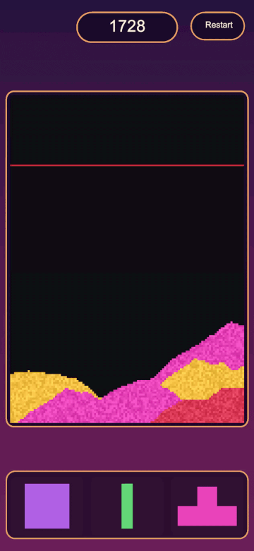

# Sand Physics Puzzle

<p align="center">
  
</p>

A tetromino stops being a shape the moment it lands and becomes a few hundred grains of sand.
Same-coloured grains touching both side walls clear, in whatever shape they ended up in.

**Unity 6000.3.10f1** · Burst 1.8.28 · Job System · Collections 2.6.2 · Mathematics 1.3.3 ·
URP 17.3.0 (Renderer2D) · Input System 1.18.0

---

## The grid

`NativeArray<byte>`, 120 × 168 = 20,160 cells, one `Allocator.Persistent` allocation for the run.
Low four bits are the colour id, `0x80` marks a grain frozen mid-clear. Stepped 120 times a
second (60 Hz tick × 2 sub-steps).

## The three jobs

**`SandStepJob`** — `[BurstCompile(CompileSynchronously = true)] IJob`, `Run()` on the calling
thread. Single buffer, scanned bottom-up: rows are processed from the floor upward and grains
move in place. Because the destination row is already processed, a grain cannot move twice in a
step and two grains cannot land in the same cell — mass is conserved by construction, with no
second buffer, no atomic claim pass and no reconcile pass. Scan direction and diagonal preference
flip every step so piles do not drift sideways. No floating point anywhere in it.

Single-threaded on purpose: the rule is order-dependent, and the ordering guarantee is worth more
than the threads at this size.

**`ClearDetectJob`** — `[BurstCompile(CompileSynchronously = true)] IJob`. Eight-way flood fill
for regions spanning both walls, over a persistent `NativeList<int>` stack with a stamp-compared
visit buffer, so a clear allocates nothing and never needs the buffer cleared. It opens with a
cheap rejection: intersect the colours present in column 0 with those in column W-1, and skip the
fill entirely when nothing can span. That is most landings.

Flagging and deleting are separate calls. A flagged grain keeps its colour, gains the clearing
bit and freezes while still counting as solid, so the pile above does not fall through it during
the flash. Cascades then fall out for free — the next pass sees whatever the collapse formed.

**`SandRenderJob`** — `[BurstCompile(FloatPrecision.Standard, FloatMode.Fast)] IJobParallelFor`,
`Schedule(height, 8)`. One worker per row; pixels are independent, so this is the one that
parallelises. It writes straight into `Texture2D.GetRawTextureData<Color32>()` — the texture's
own memory, zero copies — with a per-grain brightness jitter hashed from the cell position rather
than stored. One point-filtered `RGBA32` texture, one draw call for the whole board.

## Chunk culling

The grid is split into 32 × 32 chunks, each tracking whether anything moved in it. A settled pile
is skipped entirely, which is most of the board most of the time. Toggleable from the config for
A/B measurement; on a settled board it measures around 30× cheaper than a full scan.

## Determinism

The piece bag and the colour picker both draw from the run's seed via
`Unity.Mathematics.Random`, the step rule has no floating point, and the render jitter is a pure
function of position. A run reproduces from its seed alone.

## Assemblies

```
Core     grid, chunk map, step job                       no game rules
Rules    turn cycle, tray, colours, clearing, scoring    no MonoBehaviour
Game     board and tray rendering, input                 no game state
App      boot, the live run, the screens
```

References only go downward. `Rules` holds no MonoBehaviour at all — the whole turn cycle counts
ticks, not seconds, and has no idea what a frame is. That is why the run owns its own clock
instead of borrowing one from whatever happens to be drawing it, and why a view can be disabled
or rebuilt without the board noticing.

## Running it

Play `Assets/04_Scenes/Game.unity` — the only scene, and the only thing in it is a camera and the
component that boots the run.

Everything tunable is on `Assets/0_Config/LevelConfig.asset`: grid size, block size, danger line,
simulation rate, sub-steps, palette, flash duration, and the two colour-draw values that are the
actual difficulty.

## Credit

The falling rule is the classic one, most legibly explained by
[The Coding Train's falling sand](https://thecodingtrain.com/challenges/180-falling-sand). Its
double-buffer version can lose grains — two pick the same empty cell and one overwrites the other
— which is exactly what the single-buffer bottom-up scan exists to make impossible.
